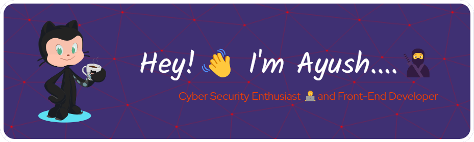

<h1 align="center">Hey....!! 👋, Are you here!!</h1>

## , I'm [Ayush!](https://aayushthakur001.github.io)

<h3 align="center">👋 Hi there! currently cyber security and digital forensics intern at @cybersecuredindia. As a Web Developer and Cybersecurity enthusiast, I love balancing creativity with security in the ever-evolving tech landscape.</h3>

  

  

- 🔭 I’m currently working with [Cyber Secured India](https://cybersecuredindia.com/)

- 🌱 I’m currently learning **Cyber Security, AI**

- 👯 I’m looking to collaborate on [Manish Roy](https://github.com/mroy0817/myntra-dashboad-clone)

- 🤝 I’m looking for help with [GEEKHUB01](https://geekhub01.blogspot.com/)

- 👨‍💻 All of my projects are available at [https://github.com/aayushthakur001/aayushthakur001/](https://github.com/aayushthakur001/aayushthakur001/)

- 📝 I regularly write articles on [https://geekhub01.blogspot.com/](https://geekhub01.blogspot.com/)

- 💬 Ask me about **Cyber Security Tools**

- 📫 How to reach me **thakuraayush900@gmail.com**

- 📄 Know about my experiences [https://drive.google.com/file/d/17GVniov2Itp6X87WSuSInTqbGh-E8Ut7/view](https://drive.google.com/file/d/17GVniov2Itp6X87WSuSInTqbGh-E8Ut7/view)

- ⚡ Fun fact **I think I am Funny**

<h3 align="left">Connect with me:</h3>

<h3 align="left">Languages and Tools:</h3>

                                          

<h3 align="left">Support:</h3>

  

&nbsp;

### 🔝 Top Contributed Repo

### 📈 My GitHub Contributions

